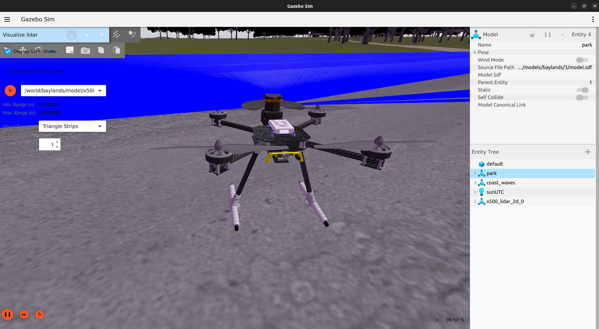
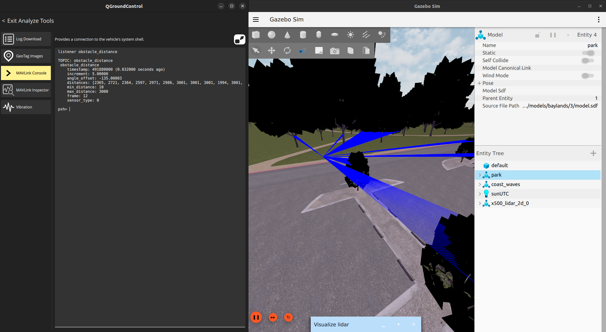

# 🚁 PX4 SITL + Gazebo + QGroundControl (tmux launcher)

Proyecto de simulación de un **dron multirrotor** usando **PX4 en modo SITL**, **Gazebo (gz)** y **QGroundControl**, con ejecución de **misiones autónomas** y **evitación de obstáculos mediante LIDAR**.

El objetivo de este repositorio es proporcionar una forma **reproducible, limpia y automatizada** de lanzar todo el entorno de simulación con **un solo comando**, usando `tmux` para gestionar los distintos procesos.

---

## 🛰️ Descripción del sistema

El sistema simula un **dron tipo quadrotor (x500)** en un entorno realista (Baylands), equipado con un **LIDAR 2D** que permite:

- Vuelo manual y asistido desde QGroundControl  
- Ejecución de **misiones autónomas**
- **Evitación reactiva de obstáculos** usando el módulo nativo de PX4

Todo se ejecuta en local mediante **SITL**, sin necesidad de hardware real.

<p align="center">
  
</p>

> 📸 *Modelo x500 con sensor LIDAR simulado en Gazebo*

---

## 🧠 Arquitectura general

El sistema lanza y conecta automáticamente:

- **PX4 SITL** (autopiloto)
- **Gazebo Sim (gz)** con el mundo `baylands`
- **Modelo x500 con LIDAR 2D**
- **QGroundControl** para:
  - Configuración del vehículo
  - Carga de misiones
  - Monitorización de sensores
  - Visualización de la evitación de obstáculos

Todos los procesos se gestionan dentro de una **sesión tmux**.

---

## 📡 Sensor LIDAR y evitación de obstáculos

El dron incorpora un **LIDAR 2D simulado**, cuyos datos son utilizados directamente por PX4 para realizar **obstacle avoidance reactivo**.

Características:

- Sensor LIDAR 2D integrado en el modelo `x500_lidar_2d`
- Visualización de rayos en Gazebo
- Datos procesados internamente por PX4
- Evitación activa durante:
  - Vuelo manual
  - Vuelo en modo **Position**
  - Ejecución de **misiones**

<p align="center">
  
</p>

> 📸 *Visualización del LIDAR detectando obstáculos en Gazebo y lectura de datos en QGC*

---

## 🧭 Ejecución de misiones

Las misiones se crean y cargan directamente desde **QGroundControl**, incluyendo:

- Waypoints
- Altitudes
- Velocidades

Durante la ejecución, el sistema de evitación de obstáculos puede modificar localmente la trayectoria para evitar colisiones, manteniendo el objetivo de la misión siempre que sea posible.

> ⚠️ La evitación es **reactiva**, no un planificador global.  
> Para un comportamiento estable se recomienda usar velocidades moderadas.

---

## 📂 Estructura esperada de carpetas

Este repositorio **NO contiene PX4 ni dependencias pesadas**.  
Se asume que todo el entorno de simulación está en una carpeta externa con la siguiente estructura:

```text
~/CPR_PX4/
├── PX4-Autopilot
├── Micro-XRCE-DDS-Agent
├── ws_sensor_combined
└── ws_offboard_control
````
> ⚠️ **Si no se poseen estas instalaciones:**
> Se recomienda seguir el tutorial básico en la página oficial de PX4: https://docs.px4.io/main/en/ros2/user_guide

---

## 🖥️ Gestión de la simulación (tmux)

La simulación se ejecuta dentro de una **sesión tmux** llamada `px4_sim`, que permite
gestionar múltiples procesos (PX4, ROS2, XRCE Agent, etc.) de forma ordenada.

> ⚠️ **No es necesario conocer tmux** para usar este proyecto.  
> Los siguientes comandos básicos son suficientes.

### Salir sin detener la simulación (desde tmux)
```text
Ctrl + b → d
```

### Salir sin detener la simulación (n (desde cualquier terminal)
``````text
tmux attach -t px4_sim
``````

### Detener TODO el sistema (desde cualquier terminal)
``````text
tmux kill-session -t px4_sim
``````
💡 Alternativamente, el script de lanzamiento incluye una opción recomendada (desde la carpeta raíz del repositorio):
```text
./scripts/run_sim.sh --kill
```
